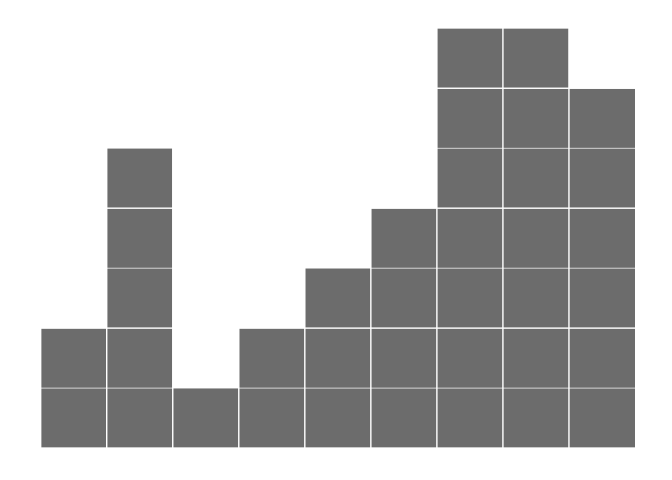
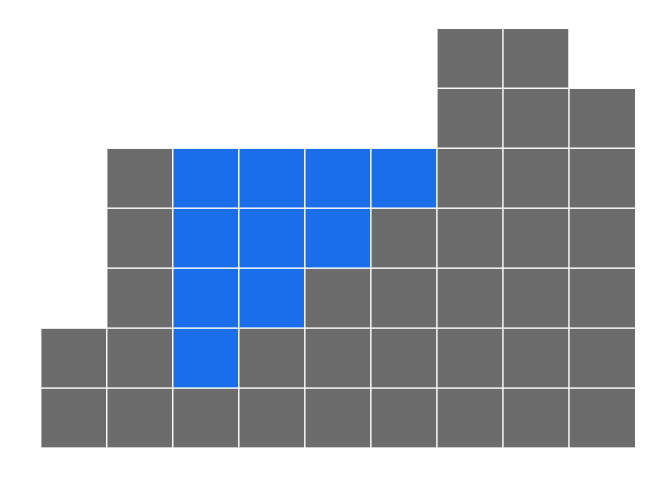

<!-- README.md is generated from README.Rmd. Please edit that file -->
waterflow
=========

[](http://www.repostatus.org/#active) [](http://cran.r-project.org/package=waterflow) []()

Overview
--------

This package is inspired by the [Twitter waterflow problem](http://chrisdone.com/posts/twitter-problem-loeb). Consider the following picture:



Figure 1 shows a series of walls and empty valleys. We can represent this picture by an array of integers, where the value at each index is the height of the wall. So in this case, the array of integers can be defined as:

``` r
x <- c(2, 5, 1, 2, 3, 4, 7, 7, 6)
```

Now imagine it rains. How much water is going to be accumulated in puddles between walls? No puddles are formed at edges of the wall and water is considered to simply run off the edge. We count volume in square blocks of 1×1. Thus, we are left with a puddle between column 2 and column 6 and the volume is 10.

Installation
------------

You can install the package directly from GitHub using the [`devtools` package](https://github.com/hadley/devtools).

``` r
# install.packages("devtools")
install_github("nathaneastwood/waterflow")
```

Useage
------

To use the package, simply generate a new instance of the `waterflow` class by providing it with a vector of data.

``` r
library(waterflow)
p <- waterflow$new(x)
```

You can then find the total number of squares filled by the water.

``` r
p$total()
[1] 10
```

Or plot the data.

``` r
p$plot()
```


